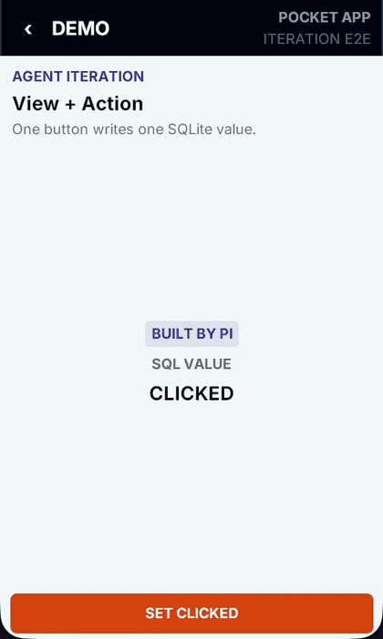
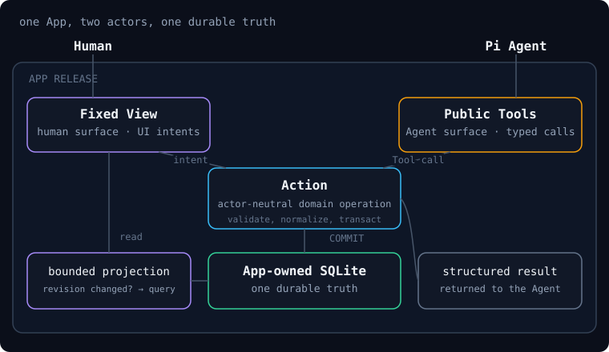
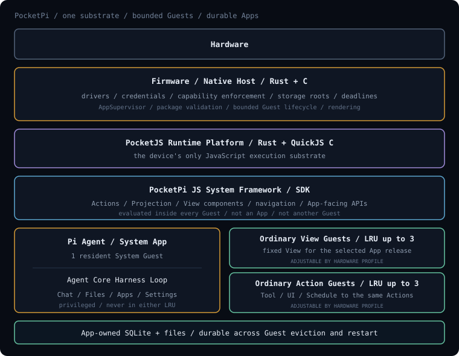

# PocketPi

[](https://github.com/pocket-stack/pocket-pi/actions/workflows/ci.yml)
[](https://pi.pocketlab.build)
[](LICENSE)

**PocketPi is an agent-native runtime for embedded devices.**

### What it means

- Powered by [PocketJS](https://github.com/pocket-stack/pocketjs), PocketPi lets developers build installable, updatable apps in JavaScript without touching the underlying firmware or hardware-specific code.
- The complete Pi Agent core harness runs as a resident part of the system, ready to use its tools and operate the app environment.
- Every app treats people and agents as first-class users: people use views, agents use tools, and both act through the same actions over the same data.

<p align="center">
  <a href="https://pi.pocketlab.build">Website</a> ·
  <a href="https://pi.pocketlab.build/docs">Documentation</a> ·
  <a href="https://pi.pocketlab.build/docs/getting-started">Getting started</a> ·
  <a href="https://pi.pocketlab.build/docs/app-quickstart">Build an app</a>
</p>

<p align="center">
  <a href=".github/assets/pocketpi-app-iteration-demo.mp4">
    
  </a>
</p>

<p align="center"><sub>In this demo, the Pi Agent changes an app's action and view while its SQLite data survives the update. The user reviews and activates the candidate in the device UI. Click for the high-quality video.</sub></p>

> **Project status:** PocketPi is under active development and intentionally
> makes breaking changes while its runtime and app contract evolve. The shared
> stack currently runs on the Waveshare ESP32-P4 and ESP32-S3 touch devices.

## What can you build?

PocketPi apps are independently installable source packages. They can be
installed and updated without reflashing the firmware.

| Use case | What PocketPi provides |
|---|---|
| Research and connected utilities | Bounded native services, app tools, local history and a dedicated touch view |
| Personal dashboards and workflows | app-owned SQLite, actions shared by UI and agent, and durable schedules |
| Device-specific interfaces | A retained view SDK designed for small touch displays instead of a browser DOM |
| agent-developed apps | Source inspection, isolated editing, runtime rehearsal, human review and atomic app updates |

The repository includes an Exa research app and a Robinhood portfolio app as
examples of the same app model applied to very different domains.

## One app, two actors

An app is **data + actions + view**.

<p align="center">
  
</p>

- **data** is durable app-owned SQLite and files.
- **actions** are actor-neutral operations called by tools, UI events or
  schedules.
- **view** is the fixed human-facing projection, assembled from the PocketPi
  view SDK.
- **tools** give the agent a typed, bounded surface over the same actions.

This keeps the product understandable from both sides: the UI is not generated
ad hoc, and agent behavior does not bypass the app's domain logic.

## How the runtime fits together

<p align="center">
  
</p>

[PocketJS](https://github.com/pocket-stack/pocketjs) is the JavaScript runtime
substrate: one QuickJS execution platform, a native rendering core and bounded
host modules. PocketPi adds the resident Pi Agent, workspace, schedules, app
lifecycle and product model above it.

The native host retains trusted mechanisms such as credentials, networking,
storage roots, hardware access and guest lifecycle. Ordinary apps remain
isolated guests with replaceable JavaScript source and durable data outside the
guest heap. The current agent loop and tool call harness is provided by
[`pi-agent-core`](https://github.com/badlogic/pi-mono).

Read the [runtime mental model](https://pi.pocketlab.build/docs/mental-model)
or the repository's [architecture reference](ARCHITECTURE.md) for the ownership
and lifecycle boundaries.

## Run PocketPi locally

The macOS `esp32-sim` runs the same AgentOS, app source, tool catalog, workspace
and view contracts as the physical targets, with development adapters in place
of board hardware. It is a product-contract simulator, not a desktop PocketPi
product or an ESP32 CPU/peripheral emulator.

Prerequisites: macOS, Rust stable and a logged-in `codex` CLI. Bun is needed
only when regenerating the Pi Agent or view SDK assets.

```sh
git clone https://github.com/pocket-stack/pocket-pi.git
cd pocket-pi

cargo xtask run esp32-sim \
  --backend codex \
  --workspace target/esp32-workspace
```

Reuse the workspace path to preserve agent files, installed apps and app data
between launches. See [Getting started](https://pi.pocketlab.build/docs/getting-started)
for provider options and the first verified run.

### Replay the app-iteration demo

The README walkthrough uses a deterministic simulator scenario. It exercises
the real app checkout, file edits, submission, review, installation, action,
SQLite and view paths while replacing model latency with a recorded tool call
sequence.

```sh
cargo run -p pocket-pi-esp32-sim -- --demo app-iteration
```

## Build an app

An ordinary app is a small source tree:

```text
my-app/
├── app.json        # identity, capabilities, tools and native services
├── schema.sql      # initial SQLite schema
├── migrations/     # optional ordered data upgrades
├── actions.js      # domain operations shared by every actor
└── view.js         # human UI assembled from the view SDK
```

The JavaScript is loaded directly by the runtime; ordinary app changes do not
need a Node.js bundle, a TypeScript compiler or a firmware rebuild. Start with
the [app quickstart](https://pi.pocketlab.build/docs/app-quickstart), then use
the [complete app guide](https://pi.pocketlab.build/docs/app-guide) for data,
actions, tools, view, services and testing.

## Hardware

The shared runtime has been implemented and physically validated on:

- **Waveshare ESP32-P4-WIFI6-Touch-LCD-5** — ESP32-P4NRW32, 32 MB PSRAM,
  5-inch 720 × 1280 touch display;
- **Waveshare ESP32-S3-Touch-LCD-4.3** — ESP32-S3-WROOM-1-N16R8, 8 MB PSRAM,
  4.3-inch 800 × 480 touch display.

Follow the dedicated [ESP32-P4](https://pi.pocketlab.build/docs/esp32-p4) or
[ESP32-S3](https://pi.pocketlab.build/docs/esp32-s3) guide for toolchains,
provisioning, flashing and the current physical validation boundary.

## Repository map

```text
apps/                       Pi Agent system app and example ordinary apps
crates/pocket-pi-agentos/   app supervision, lifecycle and runtime contracts
crates/pocket-pi-embedded/  embedded agent loop bridge
crates/pocket-pi-tools/     workspace, time, shell and schedule tools
hosts/esp32-sim/            macOS product-contract simulator
firmware/esp32-common/      shared ESP-IDF host services
firmware/esp32-p4/          ESP32-P4 board host
firmware/esp32-s3/          ESP32-S3 board host
site/                       PocketPi website and documentation
tools/xtask/                build, package and snapshot commands
```

## Development

```sh
cargo test --workspace
bun test apps/pi-agent/text.test.js
cargo clippy --workspace --all-targets -- -D warnings

cargo xtask build esp32-sim
cargo xtask build esp32-p4
cargo xtask build esp32-s3
```

Simulator and cross-build success do not replace physical acceptance for LCD,
touch, LittleFS, NVS, Wi-Fi, memory pressure or live device transport. See the
[validation status](https://pi.pocketlab.build/docs/validation-status) for the
current evidence boundary.

## License

MIT
