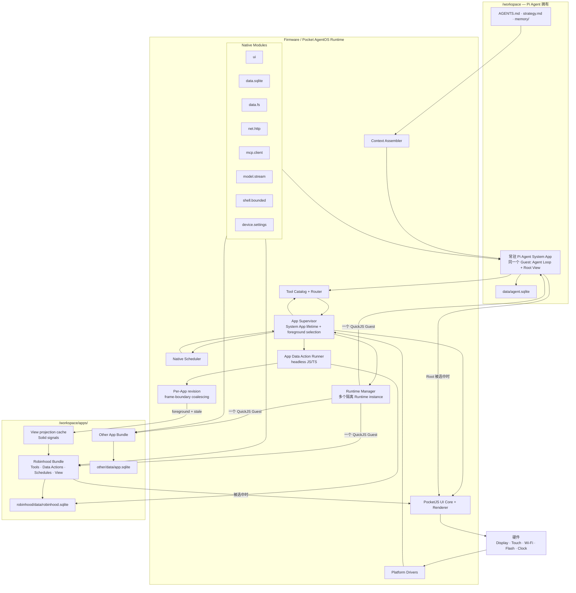

# Pocket Pi AgentOS 架构设计

Pocket Pi 是面向嵌入式设备和专用设备的完整 Agent-native runtime。Agent 是设备
上的常驻 system actor，而不是运行在通用桌面或移动操作系统上的用户应用；设备的
workspace、native tools、schedules、Agent-native Apps、本地状态、UI 和生命周期共同
构成 Pocket Pi。

ESP32-P4 是第一台完整支持的硬件和当前 reference implementation。macOS 上的
`esp32-p4-sim` 只用于开发和 product-contract 验证，不是 Pocket Pi 桌面产品、通用
`pi-agent-core` SDK 或第二个硬件 target。本文件定义的是完整设备 runtime 的
AgentOS/App 语义，不定义 standalone Agent harness。

状态：架构基线 + v1 实现记录（以“常驻 Pi Agent System App”为当前实现）。

截至 2026-08-12，当前工作树已经实现可运行的第一版：Pi Agent Root App、App
Supervisor、App Tool Catalog/Router、`AppTask` Schedule、`data.fs`、
`data.sqlite`、后台 Data Action、revision-coalesced projection cache，以及
Robinhood 和 Exa 两个可选 App，以及 build-time App selection。
Simulator contract tests 已通过；常驻 System App refactor 已在 ESP32-P4 实机
完成冷启动、LittleFS App 加载、Root View、MIPI-DSI/Touch 初始化、Agent Tool
Registry 启动和一次完整 UART model turn。运行中切换普通 App 的生命周期 contract
已有自动测试；实机触摸切换仍保留为发布前人工体验验收。

本文件同时保留最终架构约束。标为“待补齐”的部分不能因为 v1 已经能启动而
被误认为已经完成。

## 1. 一句话结论

Pocket Pi 是一套设备级 Agent-native Runtime：Rust/native host 提供稳定的硬件、
安全和生命周期机制；Pi Agent 作为常驻 System App 拥有顶层 `/workspace`；每个 App
是一个预编译 PocketJS Bundle，里面包含暴露给 Agent 的 Tools、内部 Tasks、
Schedules、SQLite 数据和绑定这些数据的固定 View。

最短的理解方式是：

```text
Firmware = 稳定机制
Pi Agent = /workspace 的 owner + 特殊 System App
App      = Public Tools + Data Actions + SQLite State + Cached Fixed View
```

### 1.1 三条核心设计原则

1. **App 是 Agent-facing capability、App-owned state 和 human-facing fixed View
   的同一个产品单元。** Tool 不是脱离 UI 的插件，View 也不是脱离能力的页面；
   二者读取同一份本地状态。
2. **State 是能力与 View 之间唯一的协调面。** Agent Tool、App Schedule 和 UI
   action 汇入同一个 Data Action；一次业务 transaction 成功后只发布一次单调
   revision，View 再查询 bounded SQLite projection。Agent 不手工同步 View，View
   也不直接执行 provider 副作用。
3. **Agent 负责决定“为什么、何时做”，App 负责确定性地完成“怎么做、怎么保存、
   怎么显示”。** AppTask、定时刷新和 View 渲染不需要模型 turn；模型是跨 App 的
   编排者，而不是每个产品功能的运行时依赖。

Pi Agent 常驻 System App、Core/Bundle ownership 和前后台 Guest 生命周期，都是为了
落实上述原则形成的架构约束；它们本身不是额外的产品 core concept。

### 1.2 PocketJS 与 Pocket Pi AgentOS 的层次

这两个层次不能合并理解：

| 层 | 当前负责什么 | 不负责什么 |
| --- | --- | --- |
| PocketJS | 单个 QuickJS Guest、TS/TSX Bundle、UI tree/layout/render、`data.fs`、`data.sqlite`、`fetch()`/`pocket-net` 等 portable module contract | 不知道 Pi Agent、`/workspace` owner、有哪些 App、哪个 App 在前台、哪个 Tool 属于哪个 App |
| Pocket Pi AgentOS | `AppSupervisor`、System/ordinary App 生命周期、Tool Catalog/Router、Data Action queue、AppTask Schedule、revision delivery、App data ownership | 不重新实现 PocketJS 的 UI、JS engine、DB/FS/net module 形状 |
| Host adapter | 把 portable contract 接到 LittleFS/SQLite、ESP HTTP/TLS、MCP、Keychain/NVS、LCD/Touch 和资源限制 | 不拥有 Robinhood/Exa 的 schema、provider mapping 或 View |

因此 `AppSupervisor`、`RoutedToolHost` 和 `AppDataRunner` 不是 PocketJS 缺失的基础能力，
而是建立在 PocketJS Guest/module primitives 之上的 **AgentOS 跨 App 产品语义**。
PocketJS 类似可移植的嵌入式 application/UI runtime；它不应替具体产品决定 App
catalog、Agent Tool ownership 或后台任务生命周期。如果其中某个 primitive 将来被
证明对所有 PocketJS 产品都通用，可以再上游抽象，但 Pocket Pi 的 ownership policy
仍留在 AgentOS。

## 2. 设计目标

1. 在嵌入式和专用设备上提供完整常驻 Agent runtime，而不是构建通用桌面 Agent、
   Node compatibility layer 或 standalone `pi-agent-core` SDK。
2. Robinhood、Exa 等产品逻辑和 UI 不再进入通用 Rust 固件。
3. App 可以给 Pi Agent 暴露 Tools，但不需要暴露内部表结构、凭据、网络协议
   和 UI 实现。
4. App 可以在本地按时运行任务，不需要每五分钟都唤醒模型。
5. SQLite 是 App 数据的唯一持久化真相；成功写入后，正在显示的 View 自动
   更新，但不能每帧轮询数据库。
6. 普通 App 彼此隔离；Pi Agent 始终拥有整个 `/workspace`。
7. 同一套 App 源码和 Module contract 可以在模拟器、ESP32-P4 和后续硬件上复用。
8. Agent 工作与前台 View 导航解耦：模型/Tool 在运行时，触摸、键盘、切换
   Robinhood/Exa 和返回 Agent 都不能中断或重建 Agent。

## 3. 第一版明确不做什么

- 不做应用市场和远程分发协议。
- ESP32 不修改 App/Root View 源码，不编译 PocketJS Bundle。
- 不做 Agent 动态创建 Tools 或 workflow interpreter。
- Tool 变化后可以 reload Agent session，不要求 live hot-plug。
- ESP32 不提供通用 POSIX shell、进程、多用户或桌面式多任务。
- 凭据永远不直接暴露给 App 或模型。
- 不自动把上游 MCP `tools/list` 的所有 Tool 暴露给模型。

合法 Bundle 怎么进入 `/workspace/apps/` 不属于本架构。第一版可以预装，也
可以通过 Mac 开发/部署路径复制。这里定义“如何加载和运行”，不定义“如何
分发”。

当前预装由 `crates/pocket-pi-app-pack` 在 build time 组合。`pi-agent` 始终存在；
ordinary Apps 只通过一个 `--apps` build 参数选择，例如 `--apps robinhood,exa`、
`--apps exa` 或 `--apps none`。未选择的 App 不进入 catalog、Tool definitions、
native policy 或 Root Apps View；已有 App data 不自动删除。

## 4. 核心概念

### 4.1 Firmware / Runtime

受信任的 Rust 代码，负责：

- 硬件驱动；
- QuickJS 生命周期；
- PocketJS UI core 和渲染；
- SQLite 和文件系统挂载；
- 模型、网络、MCP、凭据；
- Scheduler；
- App 加载、隔离和路由；
- 资源限制与恢复。

Firmware 只提供机制，不包含 Robinhood、Exa、Weather 等产品逻辑。

### 4.2 Pi Agent Root Runtime

Pi Agent 不在 `/workspace/apps/` 下。它的 home 和文件权限根就是
`/workspace`。

它同时也是一个特殊 System App：选择它时，板子显示它的 PocketJS Root
View；打开其他 App 后，它可以继续在后台等待模型、Tool 或 Agent Schedule。

它不是两个拼接起来的 runtime。`pi-agent-core` Agent Loop、context、Tool
Registry 与 Root View 必须挂载在**同一个 PocketJS Guest**，共同构成一个
`pi-agent` App instance。App Supervisor 在启动时创建一次这个 instance，并
保持到系统关机或明确的 System App restart。

`foreground App` 只是“当前哪个 View 产生 DrawList、接收触摸”的选择，不是
Agent 的生命周期开关。打开普通 App 不得 drop、reload 或 reset Pi Agent
Guest，也不得清空 conversation、pending model request 或 pending Tool call。

### 4.3 App

一个 App 是一个独立版本单元：

```text
Public Tools   Agent 能看到的名称、描述和 JSON Schema
Data Actions   Tool、Schedule、UI refresh 共用的后台数据入口
SQLite State   App 自己的唯一持久化业务真相
Fixed View     SQLite bounded projection 的内存 cache + PocketJS UI
```

“Fixed View”只表示当前 release 内固定，不表示写死在 Rust 固件里。

### 4.4 Native Module

Native Module 用固定 spec 把一个受限 Rust 能力挂载给 QuickJS Guest。

PocketJS 已经定义了 `ui`、`data.sqlite`、`data.fs`、`fetch()`/`pocket-net` 的
portable contract。Pocket Pi Host 为这些 contract 提供板级实现，并补充 model、
MCP、schedule、shell、device Settings 和 App lifecycle；其中 TLS、credential、
endpoint allowlist 等仍属于 Host policy，不属于 PocketJS portable API。

### 4.5 Runtime instance

Pi Agent System App 的 Agent Loop 和 Root View 共用一个常驻 QuickJS Guest。
普通 App 则可以有两个互不等待的 execution context：一个 foreground View Guest，
以及一个按需创建的 headless Data Action Guest。schema 变化时，Supervisor 先依据
App descriptor 的 `dataVersion` 删除该 App 的旧 SQLite file；View 可以立即打开空库，
version guard 不执行任何业务 query。第一次 Tool/Schedule 再在后台初始化新 schema，
不阻塞 UI。二者共享同一个 App-owned
`DbModule` owner、同一个 SQLite 文件和同一个内存 revision counter，但不共享
网络调用栈或 View reactive state。

慢模型、HTTP/MCP 和 Data Action 不在 UI tick 或 touch callback 内执行。Native
只拥有 transport、credential 和 SQLite primitive；App 的 provider mapping、
完整 response-body 解析和 transaction 仍由 JS/TS Data Action 拥有。View Guest
从不拿网络 response，也不写业务表。

## 5. High-level 架构



## 6. 必须一直成立的规则

1. `/workspace` 的 owner 是 Pi Agent，不是某个普通 App。
2. 普通 App 只能访问 Host 为它挂载的 data root。
3. Pi Agent 的 Agent Loop 和 Root View 只有一个常驻 Guest；普通 App 的 View
   与 headless Data Action 可以是两个 Guest，但必须属于同一个 App runtime。
4. 同一个 App 只有一个 SQLite owner；View 与 Data Action 的 DB ops 经该 owner
   串行化，不能各自创建会竞争同一 LittleFS 文件的 connection。
5. 只有 `AgentWake` Schedule 才会启动模型；普通 AppTask 不启动模型。
6. App Tool、App Schedule、UI refresh 可以共用同一个 Data Action。
7. 每次成功 SQLite transaction 立即递增一次 App revision；revision 通知在前台
   frame boundary 合并，render tick 不轮询 SQLite。
8. 凭据留在 native 层，不进入 App data、Agent context 或 Tool 参数。
9. Bundle 只能调用 Host 实际挂载的 capabilities。
10. 所有硬件差异都留在 Host 和 Native Modules 后面。
11. Pi Agent System App 在 Supervisor 生命周期内只创建一次；切换普通 App
    只能改变 foreground View，不能替换它。
12. 一个 host tick、View `tick()` 或 touch callback 不能等待模型、HTTP/MCP
    或 Data Action；View 只操作内存 cache，后台 Data Action 在完整 body 返回后
    才写 SQLite。
13. 普通 frame 只能比较内存 revision；revision 未变化、App 在后台或该
    projection cache 已是最新时，SQLite query 数量必须为零。
14. 产品 UI 不展示 CPU、PSRAM、FPS 或 LCD refresh telemetry；这些指标没有稳定、
    低开销且可跨硬件复用的语义。底层性能诊断只走 UART/log instrumentation。

## 7. Workspace 布局

```text
/workspace/
  AGENTS.md
  strategy.md

  memory/
    INDEX.md
    <notes>.md

  .pi-agent/
    schedule.json               Pi Agent 自己创建的 AgentWake 状态
  .system/
    app-catalog.json            可选的 App Catalog 缓存

  data/
    agent.sqlite                Pi Agent 数据
    view/
      current                   当前 Root View release id
      releases/
        <release-id>/
          pocket.json
          plan.json
          agent-app.json
          app.js
          agent.js                  Pi Agent Loop bundle，仅 System App
          app.pak

  apps/
    robinhood/
      current
      releases/
        <release-id>/
          pocket.json
          plan.json
          agent-app.json
          app.js
          data-action.js            可选；headless 数据入口，不挂载 UI
          app.pak
          migrations.json
      data/
        robinhood.sqlite
        .system/
          schedules.json        Robinhood AppTask 的运行游标和最近结果
        <其他 App 文件>
      tmp/

    <other-app>/
      ...
```

这是目标布局与当前布局的并集。当前 v1 已写入 fixed `builtin-v1` release、`current`、
App SQLite 和 App-local `schedules.json`；`data/agent.sqlite`、持久
`app-catalog.json`、`migrations.json` 仍未实现。当前 `agent-app.json.nativeServices`
保存 build-time trusted、无 secret 的 endpoint/credential-reference policy；当前 `plan.json` 也是
`seed_builtin_releases()` 生成的最小 runtime/module 记录，不是 PocketJS resolver 的
完整 target-specific plan。

Pi Agent 的挂载：

```text
data.fs      root = /workspace
data.sqlite  root = /workspace/data
```

普通 App 的挂载：

```text
data.fs      root = /workspace/apps/<app-id>/data
data.sqlite  root = /workspace/apps/<app-id>/data
```

`current` 是保存 active release id 的小文件，不依赖 symlink。它只能在新
release 完成校验后通过 `data.fs` atomic replace 切换。运行中的 Runtime 绝
不能 eval 一个只写了一半的 Bundle。

## 8. App contract

概念上，一个 App 可以这样定义：

```ts
export default defineApp({
  id: "robinhood",
  tools: {
    search_tools: { parameters: searchSchema, action: "searchTools" },
    call: { parameters: deferredCallSchema, action: "validatedProviderCall" },
    refresh_portfolio: { parameters: {}, action: "refreshPortfolio" },
  },
  providerOperations: checkedInRobinhoodAllowlist,
  actions: { searchTools, validatedProviderCall, refreshPortfolio },
  schedules: [{ id: "portfolio-refresh", everyMinutes: 5,
                action: "refreshPortfolio", args: {} }],
  view: RobinhoodView,
});
```

当前 artifact 对应为：

```text
agent-app.json   Public Tools、Schedules、capability metadata
data-action.js   后台网络、完整 body decode、normalize、SQLite transaction
app.js + app.pak 前台 projection cache 和固定 View
tool-catalog.json 可选的 App-owned deferred Tool catalog 源文件
```

Robinhood 的 `tool-catalog.json` 会在构建 `data-action.js` 时被 bundler 内联，运行时
由 `searchTools()` 和 `validatedProviderCall()` 读取；Rust contract test 也直接读取
源 snapshot，检查 54 个 operation 与 `agent-app.json.providerOperations` 完全一致。
`TOOLS.md` 只是这套契约的人类可读维护说明，不参与 build 或 runtime。

构建后产生两种不同性质的 metadata：

1. PocketJS `plan.json`：目标态由 PocketJS resolver 生成 target-specific build IR，
   保存 target、HostOps ABI、viewport、resolved capabilities 和 plan hash；当前 v1
   只播种一份最小 placeholder。
2. Pocket Pi `agent-app.json`：当前由 App checked in 的 runtime descriptor，保存
   id/version、Public Tool schemas、provider operation allowlist、Task/Schedule names
   和 App `dataVersion`。从 `defineApp()` 静态提取和 artifact hash 字段仍是目标态，
   当前代码尚未实现。

不能把这两个文件混为一谈。`plan.json` 继续遵守 PocketJS platform contract；
App Supervisor 读取 `agent-app.json` 建立不需要启动 Guest 的 Tool/Schedule
catalog。

完整 release 的目标 metadata 至少应包含：

- App id 和版本；
- Public Tool schemas；
- Schedule declarations；
- capability requirements；
- viewport contract；
- artifact hashes。

当前 build-selected embedded catalog 已能只解析 descriptor 建立 Agent Tool Catalog，但 ordinary
View 仍会在 Supervisor 启动时全部 preload；动态发现和按需 residency 尚未实现。

### App 内部依赖方向

```text
Agent Tool ─────┐
App Schedule ───┼──> Data Action ──> Native transport ──> SQLite transaction
UI refresh ─────┘                                             │
                                                              ▼ commit
                                                       App revision++
                                                              │
                                              foreground frame coalesces
                                                              │
                                                              ▼
                                             bounded query -> memory cache -> View
```

这是一条所有 App 都必须遵守的依赖方向，不是 Robinhood 特例。View 不调用网络、
不写业务表、也不把 response 直接 render；Data Action 不持有 View state。Agent
不需要知道 App 的 SQLite 表名。

## 9. App Supervisor

当前 v1 的 App Supervisor 是受信任 Host 代码，实际负责：

- 接收 build-time App pack，并解析所选 App 的 `agent-app.json`；
- 把固定 `builtin-v1` artifacts 原子写入各 App release 目录和 `current`；
- 根据 `dataVersion` 只重建变化 App 的开发期 SQLite；
- 启动一次 Pi Agent System App，并 preload 所选 ordinary View Runtime；
- 挂载正确的 data root 和 Modules；
- 切换前台 App；
- 路由 App Tool/AppTask，并用一个 bounded Data Action queue 串行执行；
- 注册、持久化并推进 App Schedules；
- 共享每个 App 的 SQLite owner 和 revision counter。

扫描任意安装 release、完整 plan/hash/signature 校验、动态创建/销毁 Runtime、迁移、
上一版本回退和 recovery UI 尚未实现，统一列在 22.2/22.3，不能从本节职责反推为
当前能力。

### 常驻 System App 与前台 View

Supervisor 持有两种不同的引用：

```text
system:     PiAgentSystemRuntime                // 启动一次，始终存在
runtimes:   Map<AppId, OrdinaryAppRuntime>      // build-selected catalog 在启动时全部 preload
active_app: Option<AppId>                       // None 表示显示 Root View
```

每个 host tick 都推进常驻 `system`；普通 App 的 `tick()` 只允许执行常量时间的
View bookkeeping，不能 poll network、写 SQLite 或重建 projection。只有被选中的
Runtime 执行 surface render；普通 App 不接管或复制 Agent Loop。由此保证：

1. Agent turn 跨 App navigation 保持同一 identity/context；
2. 后台 model completion 和 Tool completion 继续进入 System App；
3. Root projection 即使暂时不可见也可更新，返回时直接显示当前状态；
4. foreground App 出错或被卸载不会连带终止 Agent。

### 前台与 headless 执行

如果 App 正在打开，View Runtime 只处理触摸和缓存 render。Agent Tool、Schedule
或 UI refresh 都进入同一个 bounded Data Action queue；runner 按需加载该 App 的
`data-action.js`，在独立 headless Guest 中顺序执行。schema DDL 只在
`PRAGMA user_version` 不匹配时执行；正常启动不重复执行 `CREATE TABLE IF NOT EXISTS`。

如果 App 不在前台，已 preload 的 View Guest 不运行 projection reload。Data
Action 仍可更新该 App SQLite 并递增 revision；下次选择这个 View 时，前台 frame
只读取一次当前 bounded projection。preload 解决的是 bundle/QuickJS cold load，
不把后台 App 变成 SQLite polling loop。

同一个 App 可以同时有一个 cached View Guest 和一个 headless Data Action Guest，
但只能有一个 Data Action 在执行，且两者共享同一个 SQLite owner。这不是两份 App
实例，而是同一个 App runtime 的 data plane 与 view plane。

当前 v1 进一步让所有 App 共用一个全局串行 Data Action worker。这是有意的资源与
执行语义取舍，不作为当前缺陷：它换取 bounded concurrency、单一 SQLite/QuickJS
资源峰值和简单 completion ordering。只有实测出现不可接受的跨 App 阻塞后，才需要
把 worker 拆成 per-App lease 或受限 worker pool。

## 10. Scheduler

Scheduler 是 Rust 持有的时钟和持久 wake store。它支持两种 target：

```rust
enum ScheduleTarget {
    AgentWake { prompt: String },
    AppTask {
        app_id: String,
        task: String,
        args_json: String,
    },
}
```

### 10.1 AgentWake

启动一个 Agent turn，保留当前 `schedule.set/list/cancel/clear` 和自动唤醒
能力。只有需要模型判断的任务才用它。

### 10.2 AppTask

直接调用 App 声明的 Task，不调用模型。Robinhood 每五分钟刷新就是
`AppTask`。

### 10.3 生命周期

1. Supervisor 校验 Schedule 指向的 Task 确实存在。
2. 激活 release 时，按 `(app_id, schedule_id)` reconcile Schedule。
3. Rust Scheduler 把 `next_run_at`、cadence、Task args 和最近一次 enqueue 状态
   写入该 App 私有的 `data/.system/schedules.json`。App bundle 中的
   `agent-app.json` 是声明源；运行状态不再集中混放在 workspace 根目录。
4. 到期后原子 claim wake。
5. Supervisor 把 AppTask enqueue 到该 App 的 Data Action runner，并立即推进下次
   时间；不会在 scheduler tick 内等待网络。
6. Data Action 自己把 running/succeeded/failed 等 domain 结果写入 App SQLite；
   Scheduler 的运行游标不复制这份业务状态。

ESP32 默认策略：

- 同一 App 不并发执行；
- 重启后错过多个周期只合并补跑一次；
- 连续失败不会自动唤醒 Agent；
- App 可以从自己的 SQLite 显示 stale/error 状态。

当前 `last_ok` 只表示 Schedule 到期时是否成功进入 Data Action queue，不表示 provider
业务最终成功。业务 completion 由 App 自己写入 SQLite，例如 Robinhood
`refresh_runs.status`；Scheduler 不复制第二份业务结果。

## 11. Tool Catalog 和 Tool Router

第一版 Pi Agent 看到两类 Tools：

```text
Native Tools
  read · write · edit · find · grep · ls
  bash · device.status · time.now
  workspace.context
  schedule.set · schedule.list · schedule.cancel · schedule.clear

App Tools
  robinhood.search_tools
  robinhood.call
  robinhood.refresh_portfolio
  research.search · research.fetch
```

Workspace 动态自定义 Tools 不属于 v1。

### 11.1 注册

1. Native modules 提供自己的 Tool definitions。
2. Supervisor 从 active `agent-app.json` 读取 namespaced App Tool schemas。
3. Tool Catalog 检查重名和 capability availability。
4. 合并后的 definitions 注册进 Pi Agent session。
5. v1 中启用、停用或更改 App Tools 后 reload Agent session；不要求 live
   hot-plug。

### 11.2 调用

```text
Model 产生 Tool call
  -> Pi Agent Tool adapter
  -> Tool Router
       Native name -> CoreToolHost / Native Module
       App name    -> App Supervisor.enqueue_data_action(app, tool, args)
                      -> data-action.js -> native transport
                      -> 仅在 Fixed View 消费结果时写 SQLite + app.commit()
                      -> Data Action worker 直接返回真实 ToolResult
  -> normalized ToolResult
  -> Model
```

Public Tool 参数先由 Agent Tool layer 按 `agent-app.json` schema 校验；Robinhood
`robinhood.call` 的 deferred upstream schema 再由 Data Action 使用
`tool-catalog.json` 校验。Tool Router 只负责 ownership、namespaced routing 和 bounded
completion wait，不声称实现通用结果截断。所有 App Tool 都进入 headless Data Action，
不在 View Guest 执行。Agent 发起的 App Tool 等待 Data Action 的真实 completion；
UI Task 和 Schedule 只需要快速 enqueue receipt。一次 Agent App Tool 从进入 Router
起只有一个 80 秒绝对 deadline；排队、Data Action、PocketJS `fetch()` 和 native MCP
共同消费剩余时间，不能各自维护另一套业务 timeout。

## 12. Robinhood MCP 如何接入

MCP 是 Robinhood App 使用的上游协议，不是 Pi Agent 看到的 App 边界。

### 12.1 Native `mcp.client`

Firmware 负责：

- HTTPS/TLS；
- OAuth credential reference；
- MCP initialize 和 session id；
- JSON-RPC/SSE framing；
- retry 和 connection reset；
- response size limit；
- secret isolation。

### 12.2 Robinhood Bundle

App 负责：

- checked in 54 个 upstream operation snapshot 与 allowlist；
- 只向 Agent 常驻暴露 `search_tools`、`call`、`refresh_portfolio` 三个小 Tool；
- 按需返回某个 upstream Tool 的描述与完整 JSON Schema，并在调用前本地校验；
- 把本地 Tool/Task 映射到 MCP call；
- normalize provider response；
- 写 Robinhood SQLite；
- 定义 freshness、error 和 history；
- 渲染 View。

```ts
function refreshPortfolio(args) {       // 只在 headless Data Action Guest
  const snapshot = services.call("mcp.client", "callTool", args);
  db.exec("BEGIN IMMEDIATE");
  savePortfolio(snapshot);              // 完整 body 已返回并 normalize
  db.exec("COMMIT");
  app.commit();                         // 只 bump revision，不触碰 View
}
```

上游 `tools/list` 不会自动变成 54 份常驻模型 schema。App release 明确选择允许的
operation，并用 deferred lookup 避免 prompt 膨胀；native 再以同一份
`providerOperations` 做精确 allowlist。认证和 session 留在 native，具体操作决策仍由
Agent 和 Tool description 负责。

Robinhood 的研究、仓位、风险判断和是否执行交易属于 Agent policy；Pocket Pi native
边界只强制 credential isolation、operation allowlist 和 transport contract，不再复制
一套独立 Trading Manager 或风险决策引擎。这是有意的 Agent/App ownership，而不是
待修复的安全缺口。

### 12.3 Exa 如何接入

Exa 使用正式 PocketJS `fetch()` / `pocket-net` contract，而不是私有同步
`services.call("net.http")`。Bundle 选择 Exa endpoint，native policy 再把它限制为
两个固定 URL；API key 不进入 Bundle：

```text
research.search / research.fetch
  -> Exa private task
  -> fetch("https://api.exa.ai/search" | "/contents")
  -> pocket-net start（立即返回 handle）
  -> native HTTPS worker（注入 x-api-key）
  -> tick boundary drain / fetch Promise resolve
  -> normalize response
  -> search transaction 只写固定 View 消费的 searches projection
  -> app.commit() 递增 Exa revision
  -> 前台下一 rendered frame 最多重查一次搜索历史 projection
```

Firmware 注入 credential、执行 host/path allowlist、TLS、timeout 和 response
limit；Exa Bundle 拥有 endpoint 选择、请求字段、结果归一化、SQLite schema 和
搜索历史 View。native transport 不调用 QuickJS；只有 Data Action runner 的 tick
把完成事件带回 Guest。

Native transport 在进入 ESP HTTP/MCP 之前必须读取一个无锁 connection-ready
状态；未完成 association/DHCP 时立即向 Data Action 返回 error，不能让断网请求
进入 ESP-Hosted。Data Action 再按本 App 语义写 terminal failure row，View 仍只在
commit 后重读 SQLite。

`connection-ready` 只代表 association + DHCP，不伪装成互联网健康检查。ESP32-P4
hardware adapter 必须在 link 被动断开/恢复时同步更新这个状态和 Settings projection。
当前 ESP-Hosted 实机测量表明默认 `WIFI_PS_MIN_MODEM` 会把独立 TLS/HTTP 平均耗时
放大到约 8 秒；该 adapter 因此在 station start 后使用 `WIFI_PS_NONE`。这是板级
transport policy，不进入 App Bundle 或 PocketJS portable module contract。TCP/TLS
瞬时失败只重试 transport；只有 provider 明确返回 stale-session 语义时才清空 MCP
session id。

## 13. SQLite 和 View 更新

SQLite 是持久数据，不是每帧 reactive engine。每个 App v1 只有一个无锁内存
`revision: AtomicU32`，不是持久表、不是 Boolean，也不是 SQLite watch。

```text
Data Action                    View Runtime
───────────                    ────────────
network / complete body
normalize
BEGIN
write App tables
COMMIT
app.commit(): revision++  ──►  foreground frame 读取一次 revision
                               revision == loadedRevision -> 0 SQLite query
                               revision != loadedRevision -> bounded query
                                                            更新内存 cache
                                                            render cache
```

### 13.1 Debounce / coalescing 的准确位置

每次成功 transaction 都必须立即 `revision++`，不能 debounce COMMIT，也不能用
一个容易丢事件的 dirty Boolean。debounce 发生在 **notification delivery / cache
reload**：foreground View 每个 rendered frame 最多采样一次最新 revision；两个
frame 之间发生 1 次或 20 次 COMMIT，都只执行一次 projection reload，并把
`loadedRevision` 直接推进到最新值。

Data Action 不在网络前写 durable `running` row。UI 发起的 Action 可以用内存状态
显示正在执行；网络完整返回后，业务表和 terminal run result 在同一 transaction
落库并只递增一次 revision。这样失败或中断不会留下永久 `running` projection。

### 13.2 Projection cache

每个 View projection 在内存中保存：

```ts
type ProjectionCache<T> = {
  key: string;              // 例如 account + time span
  loadedRevision: number;
  value: T;
};
```

第一版 runtime 使用一个 App revision，View 可以有多个 cache，例如 Robinhood
的 accounts、selected portfolio、activity、positions 和 chart。切换已经加载且
`loadedRevision` 相同的 account/span 只切内存 signal；未加载或 stale 时只查该
bounded projection，不能重读整个数据库。

只有在实测证明单一 revision 导致明显无关 reload 后，才增加 topic/table revision。
不要一开始为每张表维护 Boolean：它会引入丢更新、跨表 transaction 一致性和大量
订阅 bookkeeping。App-level monotonic revision 是最小正确 primitive。

### 13.3 何时允许读 SQLite

- View 首次激活；
- foreground View 发现 App revision 变新；
- 用户切换到尚未加载或已经 stale 的 bounded projection。

除此之外不读。普通 frame、动画、scroll、已经缓存的 account/span 切换，以及
后台 App 都是零 SQLite query。View 从不因为打开页面而发起网络请求。

### Query 规则

- 列表 query 必须有 `LIMIT`、分页或聚合；
- 大型时间序列先聚合成 View 大小的窗口；
- Robinhood 1D/1W chart 固定为 20 个 time buckets；一次 indexed SQLite query
  恰好返回 20 行，View 只绘制这些 bucket 的 point projection；
- migrations 必须创建必要索引；
- provider 的模型 progress 在一次 host poll 内合并为至多一次 Guest delta，不能让
  每个 token 触发 JS event、layout 或 flash write；当前 UART bridge 则进一步把
  provider chunks 合并为一个 final result；
- schema version 和 migrations 由 App 管理。

### 13.4 App 数据库保存业务事实，不保存原始 Tool payload

Tool、Schedule 和 UI refresh 共享 Data Action implementation。每个 provider body
完整返回后，Data Action 在内存中 normalize，再明确更新对应的 domain tables。
View 不读取原始 provider JSON，也不在前台推断上游字段结构。通用的 append-only
`tool_events`、`results_json` 和 `document_json` 不属于产品 read model。

Robinhood v1 schema：

- `accounts`：账户 identity 和当前状态；
- `portfolio_current`：cash、buying power、day/week P&L 等当前字段，不含 total value；
- `total_value`：按 `account_number + observed_at` 保存折线图所需的 value history；
- `positions`：每个账户的当前持仓 rows；
- `activities`：每个账户最近的 order/activity rows；
- `refresh_runs`：只保存 terminal succeeded/partial/failed result。

当前 schema v5 不创建 `equity_historicals`、`pnl_trades`、`order_reviews` 或通用
raw-response cache。54 个 upstream Tool 都把结果返回 Agent；只有 Fixed View 当前消费
的 `get_accounts`、`get_portfolio`、`get_equity_positions`、`get_equity_orders`、
`get_realized_pnl`，以及 equity place/cancel 返回的 activity projection 会写 SQLite。

Exa v1 schema：

- `searches`：固定 View 消费的 query、时间、terminal status、result count 和
  top result title。`research.fetch` 结果直接返回 Agent，不进入 SQLite。

开发阶段 schema 变化由 App descriptor 的 `dataVersion` 显式触发：Supervisor 在打开
SQLite 前只删除该 App 的 `<app_id>.sqlite`，写入 App-local version marker，然后由
该 App 的 Data Action 创建新 schema；不维护 migration/backward compatibility。
不得删除其他 App、该 App 的其他 files、顶层 workspace、NVS Wi-Fi 或 credentials。

## 14. Pi Agent Root Runtime

Pi Agent 是拥有更宽 filesystem mount 的特殊 System App，负责：

- Agent/model loop；
- Chat 和 Tool run 展示；
- `/workspace` coding Tools；
- memory 和 strategy；
- bounded context assembly；
- AgentWake Schedules；
- 发现和调用已安装 App Tools；
- Files、Runs/Schedules、Device Settings View；
- `agent.sqlite` 中的 conversation、message、run、Tool call。

这是 Root Runtime 的目标职责。当前 v1 已实现 Chat、Files、Apps、Settings 与
Chat 内的 next AgentWake 摘要；独立 Runs/Schedules View 和 `agent.sqlite` 持久化仍
以 22.2 的未实现状态为准。

Agent Loop 由 System App release 中的 JavaScript `agent.js`（`pi-agent-core`）
提供，并与 `app.js` Root View eval 到同一个 PocketJS Guest。Rust 只提供
模型 transport、Native/App Tool 路由、调度和生命周期；它不拥有第二套 Agent
state machine。Root View 与 Agent Loop 同属 `pi-agent` release/runtime，这使
Agent 能在未来通过更新自己的 release 一起演进 context、Tools adapter 和 UI。

第一版不要求 Pi Agent 修改 App code、构建 Bundle 或动态增加 Tool definitions。

### 14.1 ESP32 支持的自我管理

- 读写 Agent workspace files；
- 维护 `AGENTS.md`、strategy、memory；
- 组装 bounded context；
- 创建 AgentWake Schedules；
- 使用 Native Tools 和已安装 App Tools。

### 14.2 ESP32 不支持

- 作为产品能力编辑 PocketJS 源码；
- 编译 TSX、styles、fonts 或 `.pak`；
- 修改 firmware/Rust modules；
- v1 动态加载 Tool source。

### 14.3 开发机能力

开发机可以编辑源码和构建 Root/App Bundles；该构建流程不属于 ESP32
portable contract，也不是独立的 Pocket Pi Agent Host。

## 15. Context Assembler

Context Assembler 把选定 workspace files 组装成有严格上限的 Agent context，
不是把整个文件系统全部塞进 prompt。

第一版输入：

```text
固定 system identity
/workspace/AGENTS.md
/workspace/strategy.md
/workspace/memory/INDEX.md
最新或被选中的 memory notes
紧凑的 device state
```

规则：

- 单文件和总 context 都有 byte ceiling；
- 非 UTF-8 和不支持的文件不进入 prompt；
- App 业务表不会自动进入 context；
- App Tool schemas 进入 Tool list，不重复进 system prompt；
- credentials 不进入 context；
- Agent 需要 App 数据时调用 App Tools。

## 16. Native Module 归属

| Module | Rust/native 负责 | Bundle 负责 |
| --- | --- | --- |
| `ui` | retained tree、layout、text、animation、DrawList | JSX View 和 reactive state |
| `data.sqlite` | SQLite、handles、limits、storage binding | schema、migrations、queries、transactions |
| `data.fs` | confinement、quota、atomic replace | App files 和 config |
| `net.http` | TLS、credential、policy allowlist、limits、non-blocking transport | `fetch()`、endpoint 选择和 domain decoding |
| `mcp.client` | auth、session、framing、limits | safe operation mapping 和 domain semantics |
| `model.stream` | provider transport、可选的内部 stream decode 和完整 result | Agent policy；wireless progress 可在 host poll 合并后进入 Guest，当前 UART bridge 则把 provider chunks 合并为一个 final result |
| `schedule.wake` | clock、persistence、claiming | AgentWake 或 AppTask declaration |
| `shell.bounded` | allowlisted device/workspace operations | Agent 决定何时调用 |
| `device.settings` | Wi-Fi、NVS、restart | Settings View |
| `app.lifecycle` | catalog、activation、Data Action queue、per-App revision 和 frame-boundary coalescing | descriptor、`app.commit()` 和 projection caches |
| `app.data` | 后台 Guest 生命周期、bounded queue、共享 DB owner | provider mapping、完整 body decode、transaction |

Native 层拥有稀缺资源、硬件和 secrets；Bundle 拥有产品行为。

## 17. 板子上呈现的 UI

任意时刻只呈现一个 Runtime 的 foreground DrawList。

### 17.1 Root/Home

Pi Agent Root View 当前提供 Chat、Apps、Files、Settings，以及 Chat 内的 next
AgentWake 摘要。独立 Runs/Schedules View 尚未实现。Root View 会
替代当前产品 UI 的 Rust `ScreenState`。产品 UI 不保留 legacy Rust 实现或
双轨 fallback；固件只负责渲染 PocketJS DrawList 和必要的底层硬件错误日志。

### 17.2 App foreground

打开 Robinhood 后，显示 Robinhood View。常驻 Pi Agent System App 继续在原
Guest 中运行，但 Root View 暂不产生前台 DrawList。用户仍可操作 Robinhood，
再切回时 Agent session 不变。

### 17.3 Background update

- Robinhood 关闭时，五分钟 AppTask 只运行 headless Data Action；完整网络 body
  返回后写 SQLite 并递增 revision，不加载或查询 View；
- Robinhood 打开时，Data Action 与 View 仍分离。成功 COMMIT 后，下一次
  foreground rendered frame 发现 revision 变化，只更新 stale bounded cache。

## 18. 当前 Pocket Pi 能力映射

最终架构不主动删除任何现有能力；当前 v1 的保留程度见第 22 节。

| 当前能力 | 新架构归属 |
| --- | --- |
| model request 和 streaming | `model.stream` + Pi Agent Runtime |
| OpenAI/OpenRouter/Anthropic/DeepSeek/UART adapters | Host/provider adapters |
| workspace read/write/edit/find/grep/ls | Root Agent workspace Tools |
| bounded bash | `shell.bounded` |
| `device.status` 和 `time.now` | native device/time Tools |
| `workspace.context` | Context Assembler |
| Agent `schedule.*` 和 autonomous wake | Scheduler `AgentWake` |
| Chat、Files、keyboard、message reader | Root PocketJS View |
| Wi-Fi scan/connect/forget、restart | `device.settings` + Root View |
| simulator/physical contract parity | shared runtime/module contracts |

新增而不是现有的能力包括：App Supervisor、App Catalog、App Tools、AppTask
Schedules、revision-coalesced projection cache 和 Bundle-based Views。

## 19. 设备 Target、开发 Simulator 与跨硬件

Pocket Pi 当前有一个完整支持的硬件 composition，以及一个配套开发 simulator：

| 角色 | Composition | 说明 |
| --- | --- | --- |
| Reference hardware | ESP32-P4 firmware | 第一台完整支持的设备；实现 LittleFS、touch/LCD、Wi-Fi/NVS 和嵌入式 limits |
| Development tool | ESP32-P4 simulator | 用 macOS adapter 验证相同 product contracts；不是桌面产品或硬件 target |

### 19.1 “一次适配，不同硬件跑”的准确含义

它不表示同一个 firmware binary 或同一份 byte-identical App artifact 在所有
硬件上运行。

它表示：

1. 新硬件只需要实现一次 Host 和它承诺支持的 Native Modules。
2. Hardware target 发布真实的 capability 和 viewport profile。
3. 任何 requirements 被满足的 App 都不需要写 App-specific Rust/hardware code。
4. 同一份 App 源码和业务逻辑根据 ABI、viewport、raster density 和 assets
   生成 target-specific `app.js`/`app.pak`。

以 Robinhood 为例，Tool mapping、SQLite schema、refresh Task 和 View source
保持相同；ESP32 与 simulator 只是在同一 specs 后面提供不同 display、
filesystem、network 和 credential 实现。

### 19.2 能做到跨硬件的条件

- App 不直接调用 ESP-IDF、wgpu、macOS 或 raw device API；
- capability ids 和 module specs 稳定且 append-only；
- `requires` 是硬条件，可选能力使用 `enhances`；
- UI 声明支持的 viewport policy 或 target variant；
- simulator 验证 contract，physical hardware 做最终验收；
- resource ceiling 是公开 contract，不是隐藏设备事实。

一个新 board 完成并通过这些 modules 的 contract tests 后，兼容 App 不需要再
做 board-specific port。

## 20. 这是不是 AgentOS

从产品和 runtime 的意义上，它符合 AgentOS：

1. Agent 是系统一级 actor，不是某个 App 里的聊天框。
2. Agent 拥有持久 workspace 和 context。
3. App 原生暴露语义化 Tools 给 Agent。
4. App 同时提供人类可见的 View。
5. 本地 Schedule 让系统能自主工作，不需要模型参与每个循环。
6. Native target composition 统一管理 capabilities、credentials、lifecycle 和
   hardware。
7. Tools、Tasks、State 和 View 可以作为 App 单元演进，不改 firmware。
8. Agent 的执行生命周期独立于当前前台 View，用户和 Agent 可以并行操作同一
   套 App platform。

但它不是传统通用 OS：它不提供任意进程、多用户安全、POSIX 兼容或通用
desktop。准确说法应当是：

> Pocket Pi 是一套面向嵌入式和专用设备的完整 Agent-native runtime：Agent 作为
> 常驻 system actor 拥有 workspace；本地 App 通过 Agent Tools、durable state、
> autonomous Tasks 和 human View 同时服务 Agent 与用户。ESP32-P4 是它的第一台
> 完整支持硬件。

这比“Agent UI”更准确，也比“替代传统操作系统”更克制。

## 21. 我对这套架构的理解

这套架构最重要的不是“ESP32 能运行 JavaScript”，而是 Agent 和用户用两种
接口操作同一个本地软件：

- Pi Agent 通过 App Tools 看见 App；
- 用户通过 App View 看见 App；
- 两条路径最终汇合到同一批 Data Actions 和 SQLite State。

Robinhood 是最直观的例子。Rust Schedule 每五分钟触发一次，或者模型调用
`robinhood.refresh_portfolio`，两者最终都调用同一个 `refreshPortfolio`
Data Action。它使用 native MCP/network transport，等完整 body 返回后向
Robinhood SQLite commit 一份 snapshot，然后结束。

如果 View 正在打开，revision 只使 cache 失效，并在 frame boundary 合并更新；
如果 View 关闭，不发生任何 UI 查询，下次打开直接读取最新 bounded projection。

所以 Rust 层应该“小但强”：它拥有 clock、secret、hardware、resource limit、
isolation 和 lifecycle。App Bundle 拥有名称、schema、provider mapping、业务
规则、数据库形状和 UI。Pi Agent 拥有 workspace，并决定什么时候使用这些
能力，但普通 App 的后台任务不需要模型 turn。

正是这个分离，让 Pocket Pi 可以从一个 Agent demo 发展成 App platform，也
可以从一块板扩展到多种硬件，而不需要把每个新产品重新写进 firmware。

## 22. 当前实现状态

### 22.1 已实现

1. PocketJS 固定在 upstream `origin/main` revision
   `9c809bbd047ddc75c27caa4990951a78d942477a`；Simulator 和 ESP32-P4 共用
   正式合并的 `pocket-fs`、`pocket-db`、`pocket-mod`、`pocket-net` 和
   `pocket-ui-surface` contracts。Exa Data Action 已使用正式 `fetch()` API；
   `pocket-net` 的 `start/cancel/drain` 由独立 native worker 实现，completion 只在
   Data Action tick boundary 进入 Guest。
2. Pi Agent 位于顶层 `/workspace`；Root View release 位于
   `/workspace/data/view`，其中 `app.js` 和 `agent.js` 是同一个 System App
   release；普通 App 位于 `/workspace/apps/<id>`。
3. App Supervisor 会 seed/校验 build-selected embedded release，并在启动时创建一次常驻的
   Pi Agent System App；当前所选 catalog 中的普通 App View Runtime 也全部在启动
   阶段 preload。普通 View Guest 被限制在自己的 `data/` 和 `tmp/`，切换它们不会
   替换 System App；前台导航只选择已经存在的 surface。这里没有 Marketplace、
   LRU、pinning 或 residency policy。
4. Tool Catalog/Router 合并 Native Tools 与 namespaced App Tools；Agent Loop
   和 Root View 已挂载在同一个 PocketJS Guest。模型请求由一个常驻 worker 顺序
   执行；ESP32 wireless backend 在该 worker 内复用同一个 HTTPS client，连接出错
   后丢弃。模型与 Native Tool 的慢 I/O 再以 event batch 回到 Guest，因此这些
   路径不阻塞 UI tick。
5. AgentWake store 持久化在 `.pi-agent/schedule.json`；Robinhood 的五分钟
   AppTask store 持久化在 `apps/robinhood/data/.system/schedules.json`；
   refresh 是 `AppTask`，只 enqueue Data Action，不启动模型。
6. 每个有后台数据能力的 App release 包含可选 `data-action.js`。一个 bounded
   `AppDataRunner` 顺序执行 Tool/Schedule/UI refresh；Robinhood 和 Exa View
   bundles 已删除网络调用和业务表写入。
7. 每个 App 有一个共享 `DbModule` owner。View Guest 与 Data Action Guest 使用
   同一 connection owner，避免 ESP32 `unix-none` VFS 上两个 connection 竞争同一
   LittleFS 文件；network wait 不持有 DB mutex。
8. 每次成功 transaction 调用 `app.commit()`，递增该 App 的 `AtomicU32`
   revision。只有 foreground rendered frame 会比较 revision；连续多个 commit
   合并成一次 `dataChanged`。普通 frame 与后台 App 不读 SQLite。
9. Robinhood Data Action 拥有 54 个 operation 的 checked-in deferred catalog、schema
   validation、MCP operation mapping、完整 response decode 和单次 refresh transaction；
   Pi Agent 常驻只看到 `search_tools`、`call`、`refresh_portfolio` 三个 Tool。每个
   provider 结果都返回 Agent，但只有 Fixed View 消费的数据才更新
   domain table，不保存原始 Tool payload。View 只拥有 accounts/portfolio/positions/
   activity/chart 的 bounded projection 和 cache。chart 的 1D/1W 窗口固定为 20 个
   time buckets，SQLite query 最多返回 20 行，render 不读取 DB。
10. Exa Data Action 拥有 `research.search`、`research.fetch`、PocketJS `fetch()`
    mapping 与 search-history SQLite transaction；native 只允许 Exa 的 `/search`、
    `/contents` 并注入 API key。View 从 `searches` 先读取最新 10 条搜索历史，滚动
    到边界后再按 10 条增量读取；每次 provider search 使用 Exa 标准的最多 10 条
    结果，fetch 不落库。
11. Root View 已提供 Chat、App 入口、Files、Settings 与 next AgentWake 摘要和
   屏幕键盘；Agent policy/loop 在 JS，workspace/App Tools 的受限底层实现和
   AgentWake 由 Rust host 提供。Pocket Pi 的小型 shared Design System inventory
   单独记录在 `docs/pocket-pi-design-system.md`；它只包含 PocketJS 上的基础
   typography/recipes/components，不包含 App-specific View 或 native UI logic。
12. ESP32-P4 使用 4 KiB PSRAM launcher，待 ESP-IDF entry task 退出后创建 64
    KiB internal AgentOS runtime stack；App bundle 构建后会 minify 以降低固件
    footprint，但不会把 minify 当作 stack isolation。App Data pthread 使用 128
    KiB PSRAM stack，并把 PSRAM allocation caps 继承给按需创建的 96 KiB NET
    worker；常驻 model worker 使用 64 KiB PSRAM stack。System App 的其他线程仍
    使用恢复后的 platform default。
13. AgentOS 核心 contract tests 已证明：Agent turn 进行中打开 Robinhood，仍能收到完整回复
    和 `agent_end`；普通 App 在前台时 Agent 仍能路由另一 App 的 Tool、写 SQLite
    并完成 turn。revision contract
    test 证明 3 次 commit 在下一前台 frame 只 reload 一次，5 个普通 frame 不
    reload，后台 2 次 commit 在重新打开时只 reload 一次。
14. Simulator 的核心 Data Action tests 已证明：Exa search 用一次 transaction 写入
    `searches` View projection；Robinhood 完整 fixture refresh 用一次
    transaction 写入各业务表与 terminal `refresh_runs`，形成固定 View 所需的
    projection；provider failure 只写 failed refresh run，不写入业务 projection。
15. `legacy_main()`、Rust `ScreenState` product UI 和其专属 display path 已删除，
    固件没有保留旧 UI 或死代码。
16. 删除全部 legacy Rust UI 后的基线固件已刷入 ESP32-P4；实机从 System App
    release 的 `agent.js` 在 Root Guest 中启动 Agent，并经 UART Codex backend
    完成 prompt 和 `agent_end`。当前 embedded presentation contract 已进一步改为：
    provider 可以在 host/transport 内部 stream。wireless host 会在每次 poll 内合并
    progress；当前实机 UART presentation 则在 bridge 内部合并 409 个 provider
    chunks、615 个字符后只发送一个 final result；完成后继续观察 30 秒没有 task
    watchdog。
17. ESP32-P4 的 PocketJS View 已接入真实 PPA backend，矩形填充、A8 字形混合和
    SRM 图像转换不再走全屏 CPU software fallback；每个 triple-buffer framebuffer
    保留独立 incremental render state。实机启动日志已确认
    `RGB565 backend ready: FILL + A8 BLEND + SRM`。
18. ESP32 UI owner 在运行期不再调用 `heap_caps_get_info`；此前该 API 在 TLS 使用
    后扫描碎片化 PSRAM 会长期持有全局 heap lock，使 UI 卡住并产生蓝屏式 watchdog
    dump。产品 UI 已删除全部 CPU、内存、FPS 和 LCD 状态展示，相关问题只通过
    UART/log diagnostics 观察。
19. Host 不再无条件以 60Hz 重建所有 PocketJS View。只有当前 foreground View
    dirty 时才执行 UI `frame()`、更新 retained DrawList 和提交 panel render。
    ESP32 owner 是原生 FreeRTOS task，主循环必须用
    `vTaskDelay` 明确让出 CPU，不能用 pthread 语义的 `std::thread::sleep` 代替；
    否则即使总 CPU/内存数字不高，CPU0 idle task 仍可能无法喂 watchdog。固件把
    FreeRTOS 固定为 100 Hz，因此 scheduler tick 周期是 10 ms；所有等待至少用
    `vTaskDelay(1)` 跨过一个调度点。App deadline 使用 monotonic `Instant` 计时，
    不改变 scheduler tick，也不创建亚 tick 轮询。MCP
    `EAGAIN` 重试必须先让出一个 tick，并限制重复日志。ESP32 Router 不使用受
    wall-clock 校准影响的 pthread timed condition wait；它每 tick 检查一次 result
    channel 和 monotonic deadline。
20. 当前自动化只保留 Tool catalog、安全边界、App state ownership、Data Action
    transaction、resident Agent lifecycle、Tool routing 和 revision coalescing 等核心
    contract；不保留 UI 坐标、按压视觉状态或重复 smoke tests。对应实现已通过
    ESP32-P4 release cross-build，并曾刷入实体板。稳态冷启动测得 Root、Exa、
    Robinhood View preload 分别约 2.0、2.8、3.3 秒，约 20.5 秒进入完整 UI；没有
    watchdog 或蓝屏。`dataVersion` reset 只发生一次，正常启动不重复 DDL。
21. 实机断网 Tool 验证已证明：Agent 调用 `research.search` 后，Data Action 在
    native connection-ready gate 处 fail-fast，写一条 terminal error search，随后
    删除不安全的 30 秒 ESP-Hosted 自动 reconnect 后，连续观察 120 秒没有 assertion
    或重启；用户仍可从 Settings 明确发起重连。
22. Exa schema v5 只保存固定 View 消费的 bounded search-history row：query、时间、
    terminal status、result count、top title 和 error；provider 原始 JSON、其余结果
    和 fetched document 都只返回 Agent，不进入 SQLite。每次 search transaction
    删除 7 天前的 searches；不自动执行 `VACUUM`。
23. 正式 `pocket-net` 路径曾在 schema v4 镜像的实体 ESP32-P4 上完成 Exa provider
    success、SQLite 持久化、重启恢复和 30 秒稳定性观察。schema v5 只收窄 App-owned
    projection，不改变已验证的 `/search`、`/contents` transport contract。
24. UART bridge 现在默认复用 Keychain 中已有的 Robinhood OAuth session，并只把
    access token 注入板子的 RAM-only boot config；`--provision-robinhood` 只在没有
    saved authorization 时交互补录。未传该 flag 的实机 `get_accounts` 已完成 MCP
    initialize 与 provider HTTP 200，收到 7222-byte body，不再出现
    `OAuth token not provided`。
25. Agent 发起 App Tool 时，`RoutedToolHost` 与 Data Action 共用从 Router 创建的
    80 秒绝对 deadline；worker 直接把真实结果返回等待方，不再经过 Supervisor frame
    转发，也不把 queued receipt 当作模型结果。PocketJS HTTP 和 native
    MCP 都只能使用剩余 budget，超时的 Data Action Guest 会被丢弃，避免 pending
    Promise 在后续调用中恢复。Exa 和 Robinhood 的 provider payload 都只放进
    ToolResult `text`，不再同时复制到 `details`。
26. 最新实机链路已完成 Exa search → fetch → DeepSeek 最终总结；模型 worker 内复用
    HTTPS client 后，该轮没有 TLS `-0x3000`、pthread 创建失败或重启。大 Tool Result
    同步进入 QuickJS context 时仍出现 task-watchdog warning，所以持续无人值守稳定性
    不能视为已经闭合。

### 22.2 待补齐，不能视为已实现

- Root Files 已有只读文件阅读器；conversation/message/run/tool call 还没有落入
  `data/agent.sqlite`。
- release 已有 descriptor/`pocket.json` 校验和 atomic `current` 写入，但由
  PocketJS resolver 生成并校验真实 `plan.json`、完整 artifact hash、migration
  transaction、上一版本回退和独立 recovery UI 还没有完成。
- 当前唯一完整支持的硬件 target 是 physical ESP32-P4；配套 simulator 只证明共享
  product contract，不能计作第二个硬件实现，最终验收仍以实体设备为准。
- build-selected catalog 的普通 App View 现在全部在 Supervisor 启动时 preload；真实
  ESP32-P4 启动时长已量测，但持续切换仍需人工验收。后续如果 catalog
  扩大，再依据实测在 PocketJS runtime 层设计加载策略，不能先引入 Marketplace、
  LRU/residency policy，也不能把 App UI/数据逻辑写回 Rust。
- Robinhood OAuth grant 与 Exa key 都由 Mac Keychain 复用，并只在本次 UART
  boot config 中以内存态注入；credential 不进入 App DB、workspace 或 View。
  当前 normalized schema 已分别取得 Exa search 和 Robinhood get_accounts 的实机
  provider success。
  `agent.robinhood.com` 从当前 AP 建连仍有波动，失败轮次会写 error batch，但不会
  覆盖最后一次成功的 portfolio projection。
- 实机已验证后台 Agent turn，但“turn 运行中连续触摸切换 Robinhood/Exa 再返回”
  仍需人工操作验收；自动 lifecycle/tool-routing test 已覆盖同一状态机路径。
- 通用 Data Action runner 已在当前实机验证 FreeRTOS pthread stack、断网
  failure transaction、SQLite dump、network fail-fast 与 provider success；持续
  触摸切换和成功/失败交替 retry 仍待验证。
- v1 是一个 App-level revision。Robinhood 已将 DB read 限制在 initial/
  `dataChanged` 和 account/span 的 bounded cache miss，但所有 projection cache 的
  `loadedRevision` 仍需继续显式化，随后再用板上 query 计数确认交互路径为零重读。

### 22.3 日后扩展项目：Marketplace / Distribution

当前 v1 使用 build-selected App pack，release id 仍为 `builtin-v1`，启动时把所选 artifact 播种到 `/workspace` 并
preload 全部普通 View。Marketplace 是独立的后续项目，不属于当前 runtime 完成度。
启动该项目时按下面的依赖顺序扩展：

1. 定义完整 release manifest：真实 PocketJS `plan.json`、artifact hashes、签名、
   publisher identity、capability requirements 和兼容版本。
2. 实现 staging install、完整校验、atomic activation、上一版本 rollback 和最小
   recovery UI；损坏或未授权 Bundle 不能成为 `current`。
3. 为 `dataVersion` 增加 App-owned migration transaction、失败恢复和 downgrade
   policy，替代开发期直接删除单个 SQLite 文件的策略。
4. 增加用户可见的 capability approval，特别是 credential-backed provider、network、
   schedule、device 和 workspace scope；凭据本身仍不得进入 App Bundle。
5. 在安装/启停后重建 Tool Catalog，并先采用 Agent session reload；只有真实需求出现
   后再实现 live Tool hot-plug。
6. catalog 规模扩大并取得板上内存/启动时长证据后，再设计 lazy load、pinning、LRU
   或 residency policy，不提前把这些策略写进 v1。
7. 最后补 distribution index、版本 channel、更新策略，以及 Simulator/ESP32
   同一 package 的兼容性验证。

仍明确延后：ESP32 source editing、Agent-authored Tools、通用 live Tool hot-plug，以及
不经编译的 declarative View schema。

## 23. 验收标准

1. 当前 Agent workspace、model、Settings、Agent Schedule 全部继续工作。
2. Robinhood Tool definitions 能进入 Pi Agent，但不编译进通用 Pocket Pi core。
3. Agent Tool 和五分钟 App Schedule 调用同一个 refresh Task。
4. App Schedule path 不发起模型请求。
5. 每次成功 transaction 都递增 revision；同一 frame 间隔内的多次递增只让打开
   的 View reload 一次，revision 不变的普通 frame 是零 SQLite query。
6. 后台 App 不执行 View query；重新选择时只在 revision stale 时读取一次 bounded
   projection，并立即显示当前数据。
7. 普通 App 无法读取另一个 App 的 data root。
8. Pi Agent 可以读取和管理顶层 `/workspace`。
9. 重启后 App 数据保留，错过的 recurring run 按规则合并一次。
10. 当前 v1 在 Tool schema 非法、capability 缺失或 embedded Bundle 损坏时 fail
    closed；`dataVersion` 变化只重建对应 App SQLite。migration recovery 和保留上一
    个合法 release 属于 22.3 的 Marketplace 扩展验收，不冒充当前能力。
11. 同一份 Robinhood source 通过 simulator contract tests，并用对应 target
    artifacts 在真实 ESP32-P4 上运行。
12. Agent turn 进行中可以操作键盘、打开 Robinhood/Exa、在 App 内触摸交互并
    返回 Root；Agent 不重启，pending turn 正常完成，conversation/context 保留。
13. 切换 foreground 前后 `pi-agent` Guest identity 和 boot count 不变；普通
    App failure 不得终止 System App。
14. 网络失败、超时或 malformed body 只能更新 App 的失败状态，不能阻塞 View、
    触发 View 网络重试或让 revision delivery 进入无限 retry loop。

## References

- [PocketJS core concepts](https://pocketjs.dev/docs/concepts/)
- [PocketJS platform contracts](https://pocketjs.dev/docs/platform-contracts/)
- [PocketJS DB module PR #231](https://github.com/pocket-stack/pocketjs/pull/231)
- [PocketJS FS module PR #238](https://github.com/pocket-stack/pocketjs/pull/238)
- [`ARCHITECTURE.md`](../ARCHITECTURE.md)：当前已实现的 Pocket Pi profiles 和
  Host ownership
